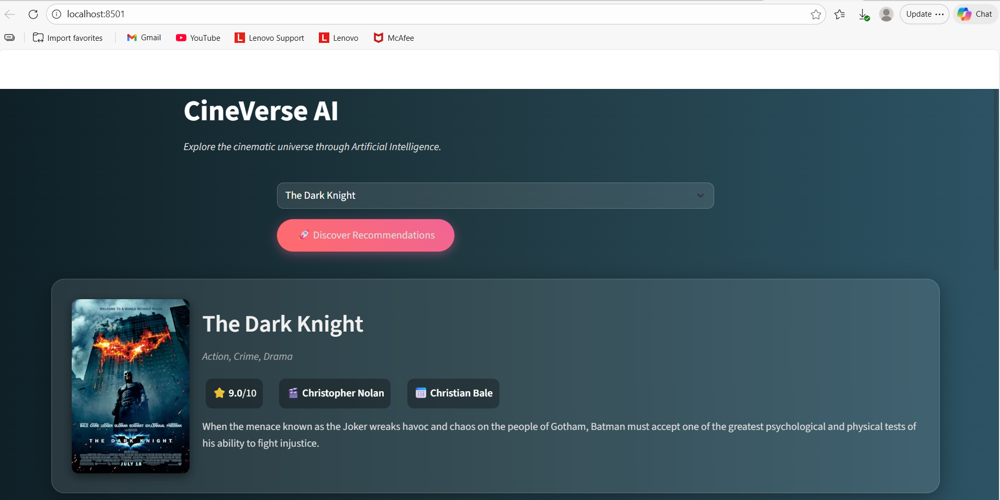

<div align="center">
  
  

  <br />
  <br />

  <h1>🎬 CineVerse AI</h1>
  <h3>The Intelligent "Cinephile-Grade" Movie Recommendation Engine</h3>

  <p>
    
    
    
    
  </p>
  
  <p>

  <br />
</div>

## 📌 Project Overview
**CineVerse AI** is a content-based recommendation system designed to solve the "cold start" problem in media consumption. Unlike collaborative filtering, which requires user history, this engine analyzes the intrinsic properties of movies (plot summaries, genres, cast, and directors) to suggest personalized content immediately.

The system processes metadata from the **IMDb Top 1000 Dataset**, creates a vectorized representation of each film, and utilizes **Cosine Similarity** to calculate the mathematical distance between movies, serving the top 5 closest matches in real-time.
<h2>🚀 Live Demo</h2>
<div align="center">
  <p>Experience the CineVerse recommendation engine live:</p>
  
  <a href="https://cineverse-ai-intelligent-movie.onrender.com/" target="_blank">
    
  </a>
  
  <br />
  
  <p><i>⚠️ Note: The app is hosted on a free Render instance. If it has been inactive, it may take 30-40 seconds to "wake up" on the first load.</i></p>
</div>
---

## ✨ Key Features
* **🧠 Content-Based Filtering:** Suggests movies based on plot keywords, genre, director, and actors.
* **⚡ Vectorized Search:** Uses `CountVectorizer` to convert text data into 5000-dimensional vectors.
* **🚀 Zero-Latency Interface:** Pre-computed similarity matrices allow for instant recommendations (<200ms).
* **🎨 Cinephile UI:** A "Dark Mode" interface with glassmorphism effects, focusing on visual appeal.
* **🔗 Smart Linking:** Recommendations include clickable posters that redirect to Google Search for immediate user action.
* **💾 Data Optimization:** Uses **Parquet** format instead of CSV for 10x faster load times and 50% storage reduction.

---

## 🛠️ Tech Stack
| Component | Technology | Description |
| :--- | :--- | :--- |
| **Frontend** | `Streamlit` | Custom CSS for Glassmorphism UI & Responsive Layout |
| **Processing** | `Pandas` & `NumPy` | Data manipulation and cleaning |
| **ML Engine** | `Scikit-Learn` | Cosine Similarity & CountVectorizer |
| **Storage** | `Parquet` | Apache Parquet for high-performance columnar storage |

---

## ⚙️ Installation & Setup
Follow these steps to run the project locally.

### 1. Clone the Repository

git clone [https://github.com/Sachin1927/movie-recommender.git](https://github.com/Sachin1927/movie-recommender.git)
cd movie-recommender

### 2. Install Dependencies
pip install -r requirements.txt

### 3. Build the Models
This script processes the raw data and generates the similarity matrix (similarity.pkl).
python src/data_processor.py

### 4. Run the App
streamlit run app.py

## 📂 Project Structure

<div style="background-color: #161b22; padding: 20px; border-radius: 10px; border: 1px solid #30363d;">
<pre style="font-family: 'Courier New', monospace; color: #c9d1d9; margin: 0; line-height: 1.5;">
movie-recommender/
│
├── data/
│   └── movies.parquet       <span style="color: #8b949e;"># Optimized dataset (IMDb Top 1000)</span>
│
├── models/
│   ├── movie_list.pkl       <span style="color: #8b949e;"># Serialized dataframe for the UI</span>
│   └── similarity.pkl       <span style="color: #8b949e;"># Pre-computed Cosine Similarity Matrix</span>
│
├── src/
│   ├── __init__.py
│   └── data_processor.py    <span style="color: #8b949e;"># Logic: Data cleaning, Vectorization, & Model Generation</span>
│
├── app.py                   <span style="color: #8b949e;"># Frontend: Streamlit Interface & Recommendation Logic</span>
├── requirements.txt         <span style="color: #8b949e;"># Project Dependencies</span>
└── README.md                <span style="color: #8b949e;"># Documentation</span>
</pre>
</div>

## 🧠 Approach & Assumptions

<h3>The Logic (Why Content-Based?)</h3>
<p>For this assignment, I chose a <b>Content-Based Filtering</b> approach over Collaborative Filtering because:</p>
<ul>
  <li><b>No User Data Required:</b> It solves the "cold start" problem effectively, working immediately without needing a user login or historical viewing data.</li>
  <li><b>Explainability:</b> We can easily articulate <i>why</i> a movie was recommended (e.g., <i>"Because you liked Inception, here are other sci-fi thrillers by Christopher Nolan"</i>).</li>
</ul>

<h3>Algorithm Steps</h3>
<ol>
  <li><b>Tag Creation:</b> I engineered a rich feature set by combining <code>Overview</code> + <code>Genre</code> + <code>Director</code> + <code>Stars</code> into a single "tag" string for every movie.</li>
  <li><b>Text Vectorization:</b> Utilized <code>CountVectorizer</code> to remove English stop words and convert the text data into 5000-dimensional numeric vectors.</li>
  <li><b>Similarity Calculation:</b> Calculated the <b>Cosine Similarity</b> (angle) between vectors. A smaller angle indicates higher similarity between two movies.</li>
</ol>


<h3>Assumptions</h3>
<ul>
  <li><b>Data Staticity:</b> The dataset is treated as static (IMDb Top 1000). Real-time database updates were considered out of scope for this MVP.</li>
  <li><b>Language:</b> The NLP processing pipeline assumes English input for plot summaries and keywords.</li>
  <li><b>Single Intent:</b> The system assumes the user is looking for recommendations similar to <i>one specific title</i> at a time, rather than a blend of multiple diverse interests.</li>
</ul>

## 📸 Screenshots
<div align="center">
  
</div>
<div align="center">
  
</div>

## 🔮 Future Improvements
```bash
[ ] Hybrid Filtering: Combine with collaborative filtering to use user ratings.

[ ] API Integration: Switch to TMDB API for real-time poster updates.

[ ] Sentiment Analysis: Weight recommendations based on review sentiment.
